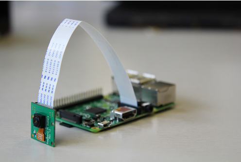

# Kamera

RaspberryPi podpira priklop Sony IMX219 modula z kamero (8MP). Pred priklopom RaspberryPi izključite (iztaknite tudi usb kabel). Za priklop uporablja t.i. flat kabel, pri katerem moramo biti pazljivi, saj je občutljiv na preveč ostre prepogibe ter druge mehanske poškodbe. Za priklop dvignite držalo flat kabla pri priključku za kamero (označen na ploščici), vtaknite flat kabel kamere, ter potisnite držalo nazaj.

Za orientacijo si pomagajte s sliko:

Priklopite nazaj napajanje, počakajte da se sistem prižge, ter odprite novo terminalno okno.

Za uporabo kamere, morate najprej pognati sudo raspi-config, ter v menuju Interfaceing
options vklopiti podporo za kamero.

Za zajem slike uporabimo ukaz `raspistill`, naprimer:
- `raspistill -o slika.jpg`

Ukaz zgoraj zažene kamero, avtomatsko zazna parametre (svetlost, ipd.), ter zajame sliko (približno 2s do zajema). Sliko shrano v datoteko slika.jpg.

Za zajem videa uporabimo raspivid:
- `raspivid -t 5000 -o video.h264`

Ukaz zgoraj bo zajel 5 sekundni video (5000ms) in ga shranil v video.h264 datoteko v mpeg4 (h264) kodeku.

- Več informacij o ukazih: https://www.raspberrypi.org/documentation/raspbian/applications/camera.md
- Več informacij o kameri: https://www.raspberrypi.org/documentation/hardware/camera/README.md

Postavite tudi streaming strežnik, kjer si lahko video ogledate kar prek navadnega spletnega brskalnika.

Navodila: https://github.com/ccrisan/motioneye/wiki/Install-On-Raspbian

Vse ukaze poganjate kot administrator (ali sudo pred ukaz, ali sudo su in potem delate kot root. Po namestitvi odprite `http://<ipnaslovraspberrypi>:8765`, (user “admin”, brez gesla), dodajte novo kamero in izberite “Local MMAL camera”.