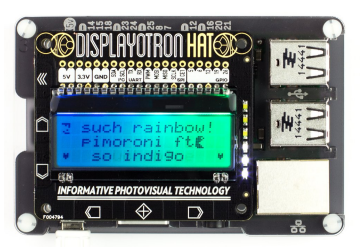

# Display-O-tron HAT



Disploy-O-tron (DOT) je dodatek RaspberyPi z 16x3 lcd prikazovalnikom, večconsko barvno osvetlitvijo ekrana, 6imi indikacijskimi LE-diodami (možnost uporabe kot graf) in kapacitivnimi gumbi. Primeren je predvsem za programiranje menujskih kontrolnih sistemov z indikatorji (menu z nastavitvami, ki ga upravljamo s pomočjo gumbov, ter barvno indikacijo stanja, zeleno/rdeče, ipd.)


- https://shop.pimoroni.com/products/display-o-tron-hat
- https://github.com/pimoroni/displayotron


Za namestitev programske opreme je proizvajalec že pripravil skripto, ki jo samo prenesemo in poženemo z interneta kar z enim samim ukazom (to storite kot navadni - ’pi’ uporabnik):
- `curl -sS get.pimoroni.com/displayotron | bash`


Skripta nas najprej vpraša, če želimo nadaljevati (’y’ + enter), sama bo vklopila SPI in I2C podporo (če ni že vklopljena) in namestila potrebne knjižnice. Vpraša nas tudi če želimo namestiti polno namestitev (dokumentacija, primeri) - izberite da (’y’ + enter). Namestitev traja nekaj minut.

Primeri uporabe so v novonastalem direktoriju, vanj se premaknemo z:
- `cd /home/pi/Pimoroni/displayotron/examples/dothat/basic`

Poženite priložene primere. Do primerov lahko dostopate tudi prek grafičnega vmesnika v istem direktoriju. Ob dvokliku na `.py` skripto izberite `Execute in terminal`.

Zagon iz terminala: `./<IME_SKRIPTE>.py`

Nekaj primerov je tudi en direktorij višje v direktoriju “Advanced”. V primeru da vam pokaže import error, odprite datoteko v urejevalniku besedil (desni klik, text editor) premaknite `sys.path.append(‘‘../../’’)`.
pred `from plugins import ...` vrstice:

```python
sys.path.append("../../")
from plugins.clock import Clock
from plugins.graph import GraphCPU, GraphTemp
...
```
