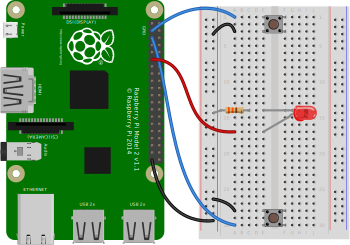

# Reaction game

In this resource, you’re going to make a quick reaction game using a few electronic components and a Python script.

Full tutorial: [Reaction game](https://projects.raspberrypi.org/en/projects/python-quick-reaction-game/0)

When you see the light come on, the first person to press their button wins!

## Building the circuit

This is the circuit you are going to build, consisting of two push-to-make buttons and an LED.




## Running the script

Create a new Python script by running the following command:
- `nano reaction_game.py`

```python
from gpiozero import Button, LED
from time import sleep
import random

led = LED(17)

player_1 = Button(2)
player_2 = Button(3)

time = random.uniform(5, 8)
sleep(time)
led.on()

while True:
    if player_1.is_pressed:
        print("Player 1 wins!")
        break
    if player_2.is_pressed:
        print("Player 2 wins!")
        break

led.off()
```
