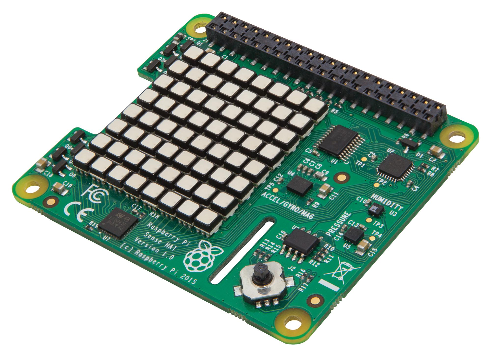

# Sense HAT

Eden izmed popularnejših razvijalskih dodatkov za RaspberryPi je Sense HAT - elektronska ploščica
z 8x8 matriko LED, žiroskopom, pospeškometrom, magnetometrom, termometrom, barometrom,
in higrometrom.




Za priklop vtaknite najprej distančnik v SenseHAT (s spodnje strani). RaspberryPi ugasnite (iztaknite USB kabel), in SenseHAT nataknite tako, kot na sliki spodaj. Stevilo priključkov na SenseHAT-u in RaspberryPi je enako, tako da morajo biti vsi pini zasedeni.


Nazaj vklopite USB napajanje. Na LED matriki se mora pokazati mavrica, ki čez nekaj sekund izgine. V primeru, da se mavrica ne pokaže, ali pa ne izgine, preverite vse povezave. Za uporabo moramo namestiti tudi knjižnico:

```bash
sudo apt-get update
sudo apt-get install sense-hat
sudo reboot # če je že nameščena ni potrebno
```

Po ponovnem zagonu, lahko kličemo SenseHAT funkcije iz programskega jezika Python. Odprite
terminal, in z ukazom `python3` poženite interpreter za Python. Vključite sense hat knjižnico,
inicializirajte objekt, ter potestirajte izpis na lcd matriki:

```python
from sense_hat import SenseHat

sense = SenseHat()
sense.show_message("Hello world!")
```

sense je objekt knjižnice SenseHAT, ki podpira razne metode za dostop do podatkov senzorjev in
izrise na matriki.

Spisek vseh metod: http://pythonhosted.org/sense-hat/api/ - preberite možnosti, in potestirajte vam zanimive metode (naprimer zajem temperature, vlage, ipd. Pod vsako metodo je na voljo primer, ki ga lahko poženete podobno kot zgoraj. Ce še niste zaprli okna z python interpreterjem, lahko prvi dve vrstici primera (import in kreiranje objekta) izpustite (potrebno samo enkrat v programu/seji).

## Spletna vremenska postaja:
https://github.com/bennuttall/sense-hat-data-web-app (probajte samo “Simple” del. Namesto
cron-a lahko za test ročno poganjate db.py v drugem terminalu). Po potrebi pokličite za pomoč.